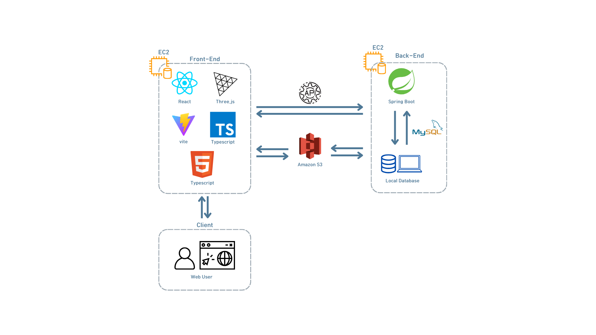

# 🔎 Intro

ShoppingNova

쇼핑노바는 우주 공간 속에서 탐험하며 LG 전자 제품을 쇼핑할 수 있는 3D 온라인 쇼핑몰입니다. 이곳에서는 쇼핑이 단순한 구매 행위가 아닌, 하나의 우주 여행처럼 느껴집니다. 광활한 우주의 배경 속에 각 제품은 반짝이는 별로 표현되어 있으며, 사용자는 이 별들을 자유롭게 회전하고 이동하며 탐험할 수 있습니다. 마치 은하계를 여행하듯 다양한 LG 전자 제품을 발견하고, 상품에 대한 상세 정보도 직관적으로 확인할 수 있습니다.

이 독특한 쇼핑 경험을 통해 쇼핑노바는 기존의 온라인 쇼핑몰을 넘어, 고객에게 색다른 즐거움을 선사하며, LG 전자 제품을 재미있게 탐색할 수 있는 기회를 제공합니다. 우주의 끝없이 펼쳐진 공간속으로 빠져들어가 제품을 찾고, 쇼핑하는 새로운 방식을 경험해 보세요!

# 📺 Project link

# 👨‍👩‍👧‍👦 Team Member
|       김건우       |       하선웅       |       정하은       |       홍성문       |
| :--------------: | :--------------: | :--------------: | :--------------: |
|        FE         |        FE         |        BE       |        BE         |
| [@dev-gonu](https://github.com/dev-gonu)|[@devnok](https://github.com/devnok) |[@bpl135](https://github.com/bpl135)|[@HHsungmoon](https://github.com/HHsungmoon)|

# 🎤 Presentation

# ⚒️ Main Feature

# Architecture

# ⚙️ Tech Stack

 
    

<!-- 

 -->
